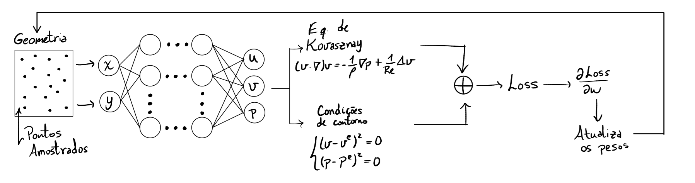
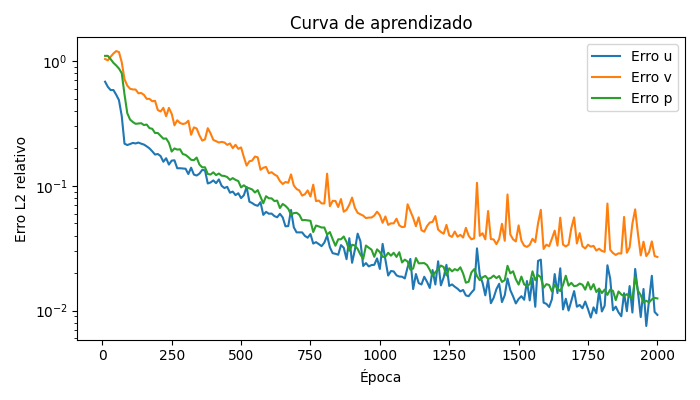
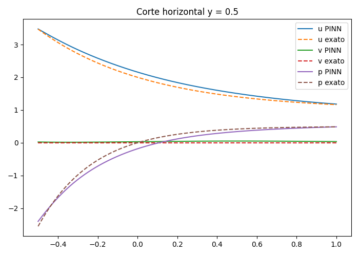
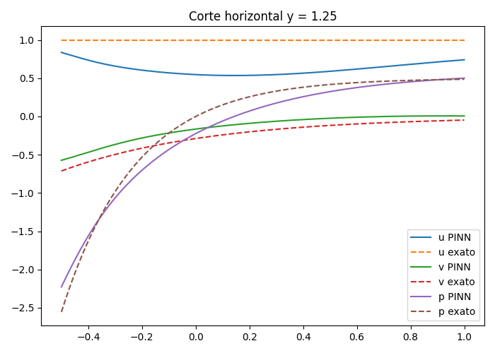
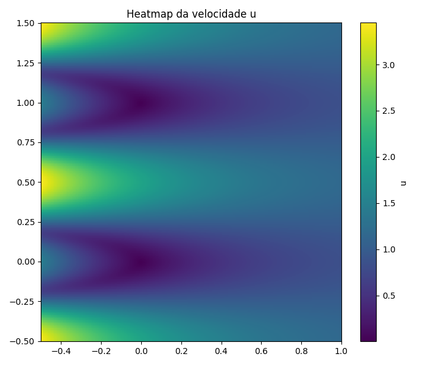
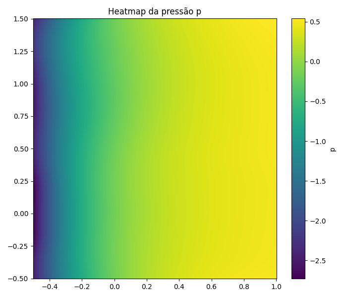
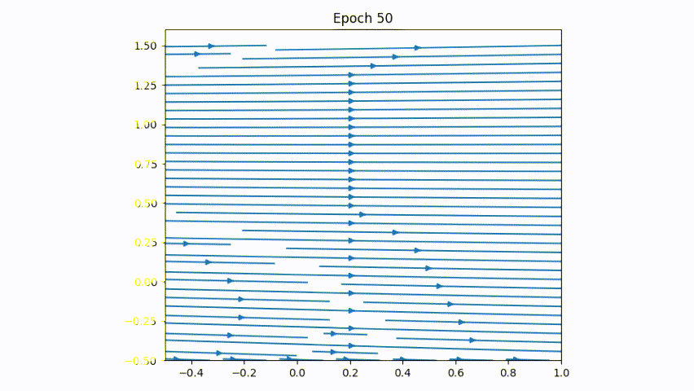

## Kovasznay Flow with Physics-Informed Neural Networks

This repository presents a numerical study of the Kovasznay flow using Physics-Informed Neural Networks (PINNs). The Kovasznay flow is a classical analytical solution of the steady incompressible Navier–Stokes equations and is widely used as a benchmark problem for validating numerical methods. The PINN framework is employed to approximate the velocity and pressure fields while enforcing the governing equations and boundary conditions through the loss function.

---

## Governing Equations

The Navier–Stokes equations describe the behavior of viscous fluid flows and constitute the fundamental model of fluid dynamics.

$$
\begin{aligned}
\rho\left(\frac{\partial \mathbf{u}}{\partial t} + \mathbf{u} \cdot \nabla \mathbf{u} \right) &
= -\nabla p + \nu \Delta \mathbf{u} + \mathbf{f}, \\
\nabla \cdot \mathbf{u} &
= 0.
\end{aligned}
$$

Under the assumptions of incompressible, steady, and two-dimensional flow, with a Newtonian fluid and constant viscosity, the Navier–Stokes equations reduce to

$$
\begin{aligned}
\frac{\partial u}{\partial x} + \frac{\partial v}{\partial y} &= 0, \\
\frac{\partial u^2}{\partial x} + \frac{\partial (uv)}{\partial y} &
= -\frac{1}{\rho} \frac{\partial p}{\partial x} + \frac{1}{Re} \left(\frac{\partial^2 u}{\partial x^2} + \frac{\partial^2 u}{\partial y^2} \right), \\
\frac{\partial v^2}{\partial y} + \frac{\partial (uv)}{\partial x} &
= -\frac{1}{\rho} \frac{\partial p}{\partial y} + \frac{1}{Re} \left(\frac{\partial^2 v}{\partial x^2} + \frac{\partial^2 v}{\partial y^2} \right).
\end{aligned}
$$

The Reynolds number is defined as

$$
Re = \frac{V_0 L_0}{\nu}.
$$

---

## Analytical Solution (Kovasznay Flow)

This problem admits a closed-form analytical solution derived by **Kovasznay (1948)**:

$$
\begin{aligned}
u(x,y) &= 1 - e^{\lambda x}\cos(2\pi y), \\
v(x,y) &= \frac{\lambda}{2\pi} e^{\lambda x}\sin(2\pi y), \\
p(x,y) &= \frac{1}{2}\left(1 - e^{2\lambda x}\right),
\end{aligned}
$$

where

$$
\lambda = \frac{Re}{2} - \sqrt{\left(\frac{Re}{2}\right)^2 + 4\pi^2}.
$$

The Kovasznay flow is widely used as a benchmark problem for validating numerical methods for incompressible Navier–Stokes equations.

---

## Domain and Boundary Conditions

The computational setup is defined as:

- Computational domain: $ \Omega = [-0.5,1.0] \times [-0.5,1.5]$;

- Velocity Dirichlet boundary conditions: $\mathbf{u}(x,y) = \mathbf{u}_D(x,y), \quad (x,y) \in \partial\Omega$;

- Pressure prescribed at the outflow boundary: $p(x,y) = p_D(x,y), \quad (x,y) \in \Gamma_{\mathrm{out}}$.

  

---

## Physics-Informed Neural Networks (PINNs)

Physics-Informed Neural Networks (PINNs) are neural networks designed to approximate the solution of partial differential equations by embedding physical laws directly into the training process. The governing equations and boundary conditions are enforced through the loss function, allowing the network to learn physically consistent solutions without requiring labeled data.

  

---

## PINN Architecture

The PINN used in this work is a fully connected feedforward neural network designed to approximate the velocity and pressure fields. The architecture consists of:

- **Input layer:** 2 neurons corresponding to the spatial coordinates $(x, y)$;
- **Hidden layers:** 4 fully connected hidden layers;
- **Neurons per hidden layer:** 50 neurons;
- **Activation function:** hyperbolic tangent (`tanh`);
- **Output layer:** 3 neurons corresponding to $(u, v, p)$.

The network weights are initialized using the **Glorot normal** initialization scheme. This architecture provides sufficient expressiveness to capture the nonlinear behavior of the Kovasznay flow while maintaining stable training.

---

## Loss Function

The loss function of the PINN is constructed as the sum of the mean squared errors (MSE) of the governing equations and the boundary conditions:

$$
\mathcal{L} = \mathcal{L}_{\mathrm{PDE}} + \mathcal{L}_{\mathrm{BC}}
$$.

The PDE loss enforces the Navier–Stokes equations and incompressibility:

$$
\mathcal{L}_{\mathrm{PDE}} = \frac{1}{n} \sum_{i=1}^{n} \left(r_x^2 + r_y^2 + r_c^2 \right)
$$,

where $r_x$ and $r_y$ are the residuals of the momentum equations, and $r_c$ is the residual of the continuity equation.

The boundary condition loss is defined as:

$$
\mathcal{L}_{\mathrm{BC}} = \frac{1}{n} \sum_{i=1}^{n} \left(r_u^2 + r_v^2 + r_p^2 \right)
$$,

where $r_u$, $r_v$, and $r_p$ denote the residuals associated with the velocity and pressure boundary conditions.

---

## Training Configuration

The training setup adopted in this study is summarized below:

- Computational domain: $\Omega = [-0.5,1.0] \times [-0.5,1.5]$;
- Number of interior collocation points: $n_\Omega = 2601$;
- Number of boundary points: $n_{\partial\Omega} = 400$;
- Number of test points: $n_{\text{test}} = 10000$;
- Network architecture: $[2,50,50,50,50,3]$;
- Activation function: `tanh`;
- Optimizers:
  - Adam optimizer with learning rate $\eta = 10^{-3}$ for 2000 iterations;
  - L-BFGS optimizer for final convergence.

---

## Results

### Streamlines

  

---

### Relative Error

  

---

### Solution Comparison Along Slices

Differences between the PINN and analytical solutions along the horizontal slices:

- $y = 0.5$;
- $y = 1.25$.

  

  

---

### Field Heatmaps

  
  
  

---

### PINN Learning Dynamics

**Streamlines during training**

  

**Particle advection**

  

